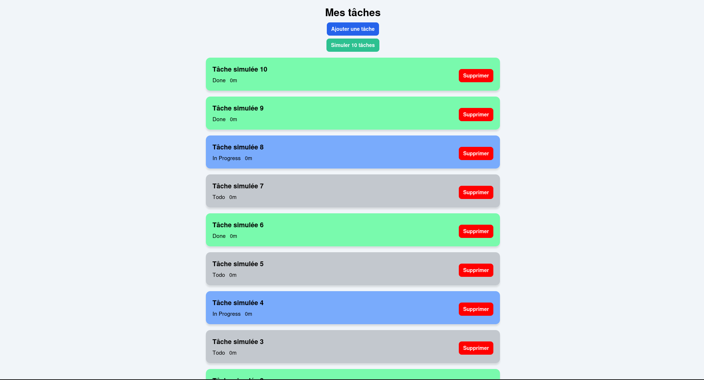

# Gestionnaire de tâches
## Table des matières

- [Description de l'application](#description-de-lapplication)
- [Technologies utilisées](#technologies-utilisées)
- [Installation et lancement](#installation-et-lancement)
- [Images](#images)

## Description de l'application

Application de gestion de tâches qui permet d'ajouter des tâches et qui affiche les 
20 dernières créées. Possibilité de lancer une simulation de création de 10 tâches. 

## Technologies utilisées

- **Langage** : Javascript / React
- **IDE** : VSCode
- **Base de données** : MongoDB

## Installation et lancement

**Prérequis**
- Node.js installé
- MongoDB installé et actif
- Expo CLI installé (`npm install -g expo-cli`)

<br>

- sous linux en mode web :
    - verifiez que mongodb est bien actif : 
    ```bash
    sudo systemctl start mongod
    ```
    - lancez le serveur quand vous êtes dans le dossier BACKEND : 
    ```bash
    node server.js
    ```
    - lancez l'application : 
    ```bash
    npm start
    ```
- avec l'application Expo GO :
    - Assurez-vous que votre téléphone est connecté au **même réseau Wi-Fi** que votre PC.
    - Dans le fichier `taskApi.js`, remplacez `BASE_URL` par l’IP locale de votre PC :
    ```js
    const BASE_URL = "http://xx:3000"; // remplacez xx par votre IP
    ```
    - lancez le serveur quand vous êtes dans le dossier BACKEND : 
    ```bash
    node server.js
    ```
    - lancez l'application : 
    ```bash
    npm start
    ```
    - Scannez le QR code avec l’application **Expo Go** sur votre téléphone.


## Images

 
 
